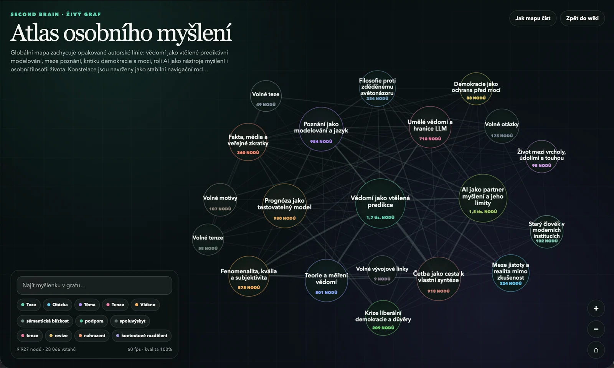

# Second Brain

Second Brain is a local-first TypeScript pipeline that turns personal writings, exported conversations, and optional chat transcripts into a traceable knowledge corpus. It preserves source provenance, separates authored text from surrounding context, compiles semantic thought nodes, consolidates related ideas, and can render human-readable and GPT-oriented exports.

This public repository contains a small, curated demo corpus: two intentionally published Czech writings and one synthetic conversation. The writings are genuine personal working manuscripts authored by the repository owner—not synthetic samples and not presented as final, copy-edited editions: `Jak těžké je něco poznat` (`jak-tezke-je-neco-poznat_04_04_2015.txt`) and `Jednotná teorie vědomí` (`vedomi_05_02_2026.txt`). They are included deliberately for professional evaluation under the restrictions in [`CONTENT_LICENSE.md`](CONTENT_LICENSE.md). The preview below is an owner-approved image generated from the private development corpus; the underlying corpus and machine-readable output are not included. The repository contains no model checkpoints or historical benchmark snapshots.



## Privacy boundary

> **Privacy warning:** `npm run master` is not an offline operation. Through the configured Codex CLI/model service, it sends normalized text segments and their adjacent `localContext` passages to an external service. Do not run it on confidential, client-owned, or third-party material unless you are authorized to do so and have reviewed the service's data-handling terms. Only the test suite and normalization demo described below are offline.

## What is included

- deterministic ingestion for dated writings, OpenAI conversation exports, and WhatsApp-style transcripts;
- a unified document and segment model with source identity and chronology;
- a checkpointed semantic compiler driven through the Codex CLI;
- deterministic consolidation, frame alignment, diagnostics, and provenance checks;
- wiki, static-site, source-archive, and GPT knowledge-pack renderers;
- an offline demo with two Czech writings and one synthetic conversation.

## Requirements

- Node.js 24 or newer;
- npm;
- optionally, the [Codex CLI](https://developers.openai.com/codex/cli/) for semantic compilation and the full pipeline.

## Offline setup and demo

The install, test suite, and normalization demo do not call an external model and require no API key:

```bash
npm ci
npm test
npm run demo:normalize
```

`demo:normalize` builds the TypeScript project and writes normalized artifacts under `output/`. The demo should report two writing records and one kept conversation. Generated output is intentionally ignored by Git.

This command stops after deterministic ingestion and normalization. It is the right first run when you want to verify your `input/` files without sending their contents to a model service.

The individual normalization commands are also available after `npm run build`:

```bash
npm run normalize:writings
npm run normalize:conversations
npm run normalize:all
```

## Optional semantic pipeline

The full `master` run is separate from the offline demo. It invokes a locally installed and authenticated Codex CLI, sends segment text and adjacent `localContext` to the configured model service, can consume model quota, and writes checkpointed semantic and presentation artifacts under `output/`.

```bash
codex login
npm run master
```

Unlike `demo:normalize`, `master` continues through semantic compilation, graph consolidation, macro-map construction, quality audits, and presentation rendering. If bounded consolidation asks for a rerun before reaching its fixed point, run the same command again; completed model batches are checkpointed and reused.

The Codex wrapper sends semantic prompts through standard input rather than
placing corpus text in process arguments. Semantic calls use the Codex
`read-only` sandbox by default and retain its Git-repository safety check. Run
the full pipeline from a normal Git clone; non-Git or writable execution must
be an explicit caller-level override.

For WhatsApp-style chat inputs, identify the archive owner explicitly so the pipeline can distinguish authored messages from context:

```bash
npm run master -- --owner YourName
```

Conversations carrying a non-empty Custom GPT/Gizmo ID are excluded by this public build. Standard conversations without a Gizmo ID pass the default prefilter when they contain more than ten non-empty turns and no code fence; the included synthetic example demonstrates this generic path.

## Inspecting a completed run

All generated results stay under the Git-ignored `output/` directory. After `npm run master` completes, useful entry points are:

- `output/site/index.html` — the generated static site;
- `output/site/graph/index.html` — the interactive thought graph;
- `output/wiki/index.md` — the Markdown wiki;
- `output/compiled/consolidated_thought_graph.json` — the provenance-aware graph data;
- `output/exports/gpt/01_ATLAS_AND_QUERY_ROUTES.md` — one concrete GPT-oriented knowledge artifact.

Open `output/site/index.html` locally to browse the rendered result. The HTML site links the atlas, trajectories, individual thoughts, tensions, chronology, references, and graph back to their generated evidence pages.

The public build intentionally omits the author's private Custom GPT prompt.
Generated `00_CUSTOM_GPT_SETUP.txt` and
`C_CUSTOM_GPT_INSTRUCTIONS.txt` files therefore contain a clearly marked,
non-functional `PUBLIC DEMO PLACEHOLDER`; it documents the export boundary and
is not a ready-to-use GPT instruction set.

## Input layout

```text
input/
  conversations/   OpenAI export JSON arrays
  writings/         UTF-8 .txt or .md files
  chats/            optional WhatsApp-style exports
```

Dated writing filenames use the suffix `_MM_DD_YYYY`, for example `essay_04_04_2015.txt`. This lets the unified corpus retain chronology without embedding dates in the prose.

The repository's `.gitignore` allowlists only these two author-provided writings and the synthetic conversation. Additional files placed under `input/` remain local by default. Review staged files before publishing any real archive.

## Pipeline outline

1. Discover and normalize raw sources.
2. Build a unified corpus while preserving source kind, time, authorship, and context.
3. Compile source segments into semantic claims, states, worldlines, nodes, and edges through the Codex CLI.
4. Consolidate compatible nodes while retaining revisions and tensions.
5. Align document frames and build a higher-level map.
6. Render the wiki, static site, source archive, and GPT knowledge pack.

The semantic stages are checkpointed so an interrupted run can resume without discarding completed batches. Deterministic stages can be rerun independently once their required compiled inputs exist.

## Demo data and rights

The conversation in `input/conversations/` is entirely synthetic and was created for this repository. It does not reproduce a real chat.

The two Czech writings are deliberately published genuine personal working
manuscripts by the author, not synthetic fixtures or final copy-edited editions. The
writings, synthetic conversation data, and graph screenshot are © Jan Utěkal,
all rights reserved. Their presence here permits viewing but does not
grant reuse rights. See [`CONTENT_LICENSE.md`](CONTENT_LICENSE.md) for the exact
file-level boundary.

## Development

```bash
npm run build
npm test
```

CI runs a clean install, the complete offline test suite, and the normalization demo. Historical private-corpus fixtures and benchmark utilities are intentionally outside the public project.

The package is marked `private: true` to prevent accidental publication to the npm registry. This does not restrict visibility of the GitHub source code.

## License

The repository's software, tests, scripts, configuration, CI definitions, and
ordinary technical documentation are licensed under the [MIT License](LICENSE),
copyright © 2026 Jan Utěkal.

The personal writings, conversation data, graph screenshot, and derived data
artifacts are expressly excluded from MIT and remain all rights reserved. See
[`CONTENT_LICENSE.md`](CONTENT_LICENSE.md) and [`NOTICE`](NOTICE) before reusing
repository material.
